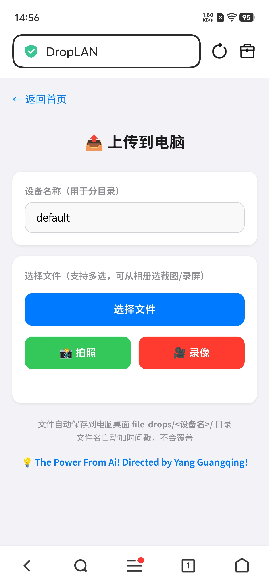
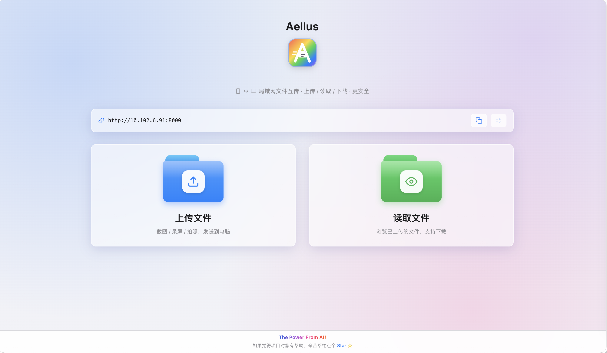
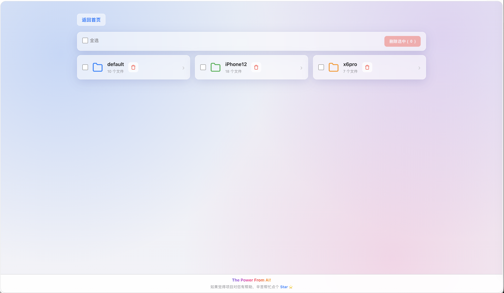

# DropLAN · 局域网文件互传

> 💡 The Power From Ai! Directed by Yang Guangqing!

DropLAN 是一个轻量的局域网文件互传服务。在电脑（macOS / Windows / Linux）本地启动后，同局域网内的手机或 PC 用浏览器访问，即可上传文件到电脑、或浏览/下载已上传的文件。专为测试工程师"测试机截图/录屏传到电脑"的高频场景设计，**零部署、免流量、跨平台**。

---

## 📸 效果图

### Android

| 首页 | 上传 | 读取 |
|:---:|:---:|:---:|
|  |  |  |

### iOS

| 首页 | 上传 | 读取 |
|:---:|:---:|:---:|
|  |  |  |

### PC

| 首页 | 上传 | 读取 |
|:---:|:---:|:---:|
|  |  |  |

---

## ✨ 功能特性

- **上传文件**：截图 / 录屏 / 拍照，一键发送到电脑
- **读取文件**：浏览已上传的文件列表，支持在线预览与下载
- **按设备分目录**：上传时填设备名，文件自动归档到 `file-drops/<设备名>/`
- **自动加时间戳**：文件名带精确到毫秒的时间戳，永不覆盖
- **响应式布局**：同时适配 PC 浏览器与手机浏览器，PC 端多列网格、手机端单列卡片
- **图片/视频预览**：上传后即时预览；读取页支持缩略图与在线播放
- **批量下载**：读取页支持勾选多个文件打包 zip 下载，或一键打包整个目录
- **访问日志**：自动记录每次访问的来源 IP、浏览器类型与请求路径，写入 `access.log`
- **安全防护**：严格的路径穿越校验，禁止 `/`、`\` 注入，`..` 经 resolve 越界即拒绝；隐藏文件（`.` 开头）不展示且不可访问
- **无需 App**：手机端无需安装任何应用，浏览器即可使用

---

## 🖥 环境依赖

### 系统要求

| 项 | 要求 |
|----|------|
| 操作系统 | **macOS / Windows / Linux** 均可（局域网 IP 获取用 socket 连接法，跨平台无系统命令依赖） |
| Python | 3.9 及以上 |
| 网络 | 电脑与手机/其他设备在**同一局域网**内 |

### Python 依赖

| 包名 | 版本（验证可用） | 用途 |
|------|------------------|------|
| `fastapi` | 0.109.0+ | Web 框架，提供路由与 API |
| `uvicorn` | 0.27.0+ | ASGI 服务器，运行 FastAPI |
| `python-multipart` | 0.0.20+ | 解析文件上传的 multipart 表单 |
| `jinja2` | 3.1.6+ | HTML 模板渲染引擎 |

> FastAPI / Uvicorn / Jinja2 安装时会自动带上 starlette、anyio 等子依赖，无需单独安装。

---

## 🚀 快速部署

### 1. 安装依赖

**macOS / Linux：**
```bash
cd ~/droplan
python3 -m pip install --user fastapi uvicorn python-multipart jinja2
```

**Windows（CMD 或 PowerShell）：**
```bat
cd %USERPROFILE%\droplan
python -m pip install --user fastapi uvicorn python-multipart jinja2
```

### 2. 启动服务

**macOS / Linux：**
```bash
./run.sh start
```

**Windows：**
```bat
run.bat start
```

启动成功会输出访问地址，例如：

```
✅ 服务已启动 (PID: 33040)
🌐 手机访问: http://192.168.1.111:8000
```

> 也可不通过脚本直接运行 `python3 -u server.py`（`-u` 关闭输出缓冲，使运行日志即时写入 `server.log`），会额外显示保存目录，按 `Ctrl+C` 停止。

### 3. 访问使用

- **本机**：浏览器打开 `http://localhost:8000`
- **手机/其他设备**：浏览器打开启动时显示的 `http://<电脑的局域网IP>:8000`

首页提供两个入口：
- 📤 **上传文件** → 填设备名 → 选文件 / 拍照 / 录像 → 上传
- 📂 **读取文件** → 选择目录 → 浏览文件 → 下载或预览

---

## 📂 目录结构

```
droplan/
├── server.py          # 主程序：路由 + API + 启动入口
├── config.py          # 配置：保存目录 / 监听地址 / 端口 / 日志
├── run.sh             # 启停脚本（macOS / Linux，start / stop / status）
├── run.bat            # 启停脚本（Windows，start / stop / status）
├── README.md          # 项目说明
├── static/            # 前端静态资源
│   ├── common.css     # 公共样式 + CSS 设计变量 + 作者署名样式
│   ├── home.css       # 首页样式
│   ├── upload.css     # 上传页样式
│   ├── upload.js      # 上传页交互逻辑
│   ├── browse.css     # 读取页样式
│   ├── browse.js      # 读取页交互逻辑
│   └── favicon.svg    # 站点图标（标签页 icon）
├── templates/         # HTML 模板（Jinja2）
│   ├── home.html      # 首页
│   ├── upload.html    # 上传页
│   └── browse.html    # 读取页
└── screenshots/       # 三端页面截图（Android / iOS / PC）
```

> 运行时会自动生成 `server.log`（运行日志）、`access.log`（访问日志）与 `server.pid`（进程记录）；停止服务后 `server.pid` 自动清除。
>
> `access.log` 每行记录一次访问，各字段带中文标注，格式如下：
> ```
> 2026-08-06 16:21:21  访问来源IP: 192.168.1.99  请求方式: GET  请求URL路径: /browse  响应状态: 200  浏览器UA: "Mozilla/5.0 (iPhone...)"
> ```
> 实时查看来访记录：`tail -f ~/tools/droplan/access.log`

### 上传文件落盘位置

**macOS / Linux：** `~/Desktop/file-drops/`
**Windows：** `C:\Users\<用户名>\Desktop\file-drops\`

```
file-drops/
└── <设备名>/
    └── 20260804_112601079_截图.png   # 时间戳_原文件名
```

---

## ⚙️ 配置说明

所有配置集中在 `config.py`，按需修改后重启服务生效：

```python
# 文件保存根目录
SAVE_DIR = Path.home() / "Desktop" / "file-drops"

# 服务监听地址（0.0.0.0 允许局域网访问）与端口
HOST = "0.0.0.0"
PORT = 8000

# 访问日志文件路径与时间格式
ACCESS_LOG = BASE_DIR / "access.log"
ACCESS_LOG_DATEFMT = "%Y-%m-%d %H:%M:%S"

# 访问日志单条记录模板（各字段带中文标注，可按需调整）
ACCESS_LOG_TEMPLATE = (
    "访问来源IP: {ip}  "
    "请求方式: {method}  "
    "请求URL路径: {path}  "
    "响应状态: {status}  "
    '浏览器UA: "{ua}"'
)
```

> 调整 `ACCESS_LOG_TEMPLATE` 可自定义日志字段与格式，无需改动 `server.py`。
> 静态资源请求（`/static/` 路径）不记录，避免每次页面加载刷屏。

---

## 🛠 服务管理

**macOS / Linux：**
```bash
./run.sh start     # 启动
./run.sh stop      # 停止
./run.sh status    # 查看运行状态与访问地址
```

**Windows：**
```bat
run.bat start      启动
run.bat stop       停止
run.bat status     查看运行状态与访问地址
```

---

## 🔒 安全说明

- **路径穿越防护**：所有目录名、文件名参数均经过 `_safe_subpath` 校验——禁止 `/`、`\`，`..` 经 resolve 后越界即拒绝，确保路径始终限定在 `SAVE_DIR` 范围内
- **设备名过滤**：仅保留字母、数字、中文、`-`、`_`，其余字符自动剔除
- **仅局域网可用**：服务监听 `0.0.0.0` 但不暴露到公网，需在同一局域网内访问
- **无身份认证**：当前版本面向可信局域网环境，未设登录鉴权，请勿在公共网络使用

---

## ❓ 常见问题

**Q：手机/其他设备打不开页面？**
- 确认电脑和设备在同一个局域网内
- 公司网络可能开启了"客户端隔离"，用手机开热点测试验证
- 首次启动若系统弹窗"是否允许 Python 接受入站连接"（macOS 防火墙 / Windows Defender 防火墙），点**允许**

**Q：换网络后访问地址变了？**
- 局域网 IP 会随网络变化，执行 `./run.sh status`（macOS/Linux）或 `run.bat status`（Windows）查看当前 IP

**Q：重启电脑后服务没自动启动？**
- 本服务未配置开机自启，需手动启动。如需自启：macOS 可配置 launchd，Windows 可配置任务计划程序

**Q：Windows 下 `python` 命令找不到？**
- 确认安装 Python 时勾选了 "Add Python to PATH"；或改用 `py` 启动器，把 `run.bat` 中的 `python` 替换为 `py`

**Q：上传大文件（录屏几百 MB）失败？**
- 当前未设上传大小限制，FastAPI / Uvicorn 默认支持大文件流式上传；若超时请检查网络稳定性

---

## 🧰 技术栈

| 层 | 技术 |
|----|------|
| 运行平台 | macOS / Windows / Linux（同一份代码，IP 获取用 socket 连接法，无系统命令依赖） |
| 后端 | Python 3.9+ / FastAPI / Uvicorn |
| 模板 | Jinja2 |
| 前端 | 原生 HTML5 / CSS3 / JavaScript（无框架） |
| 传输 | HTTP（局域网点对点，不走云端） |

---

## 💬 反馈与建议

如果您有更好的功能想法或改进建议，欢迎提 [Issues](https://github.com/YGQ8988/droplan/issues)！
