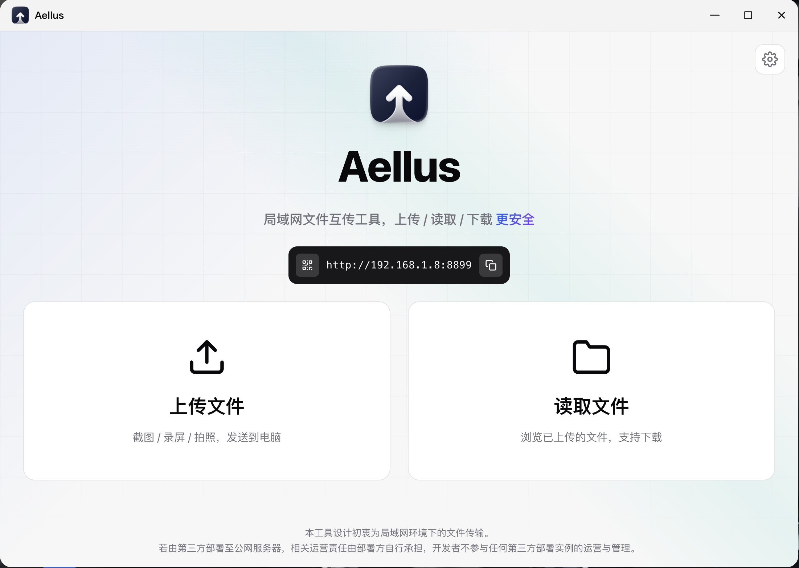
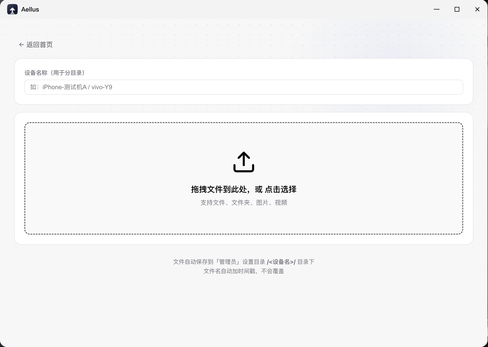
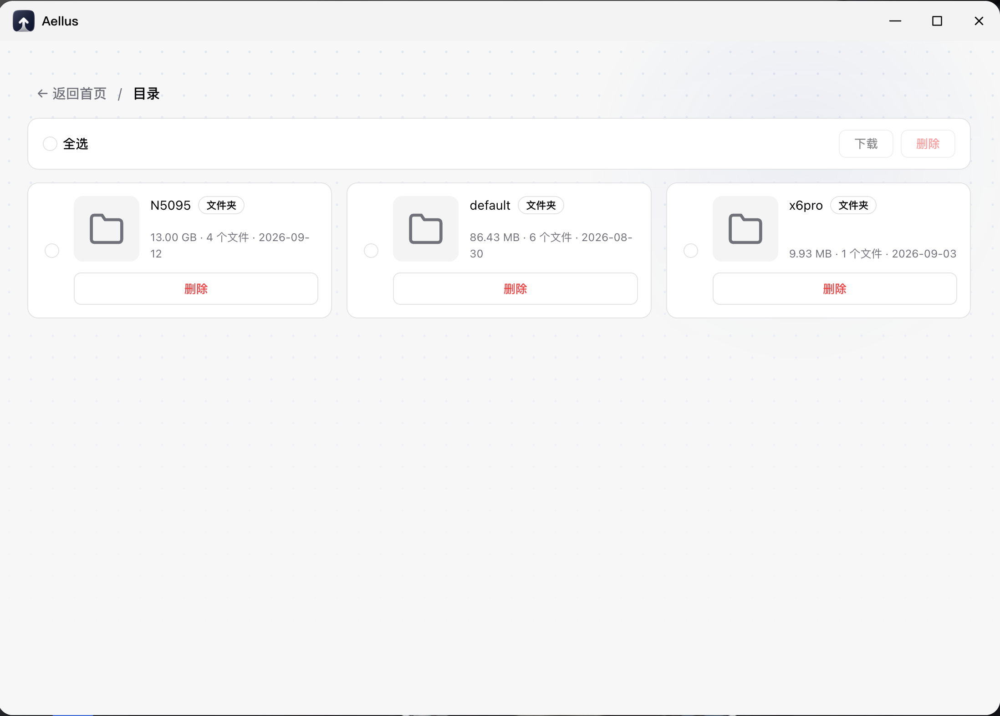
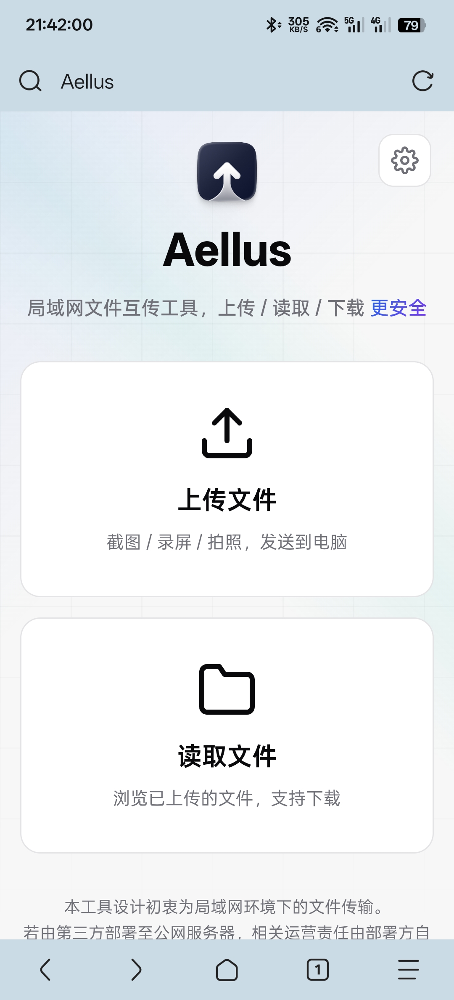
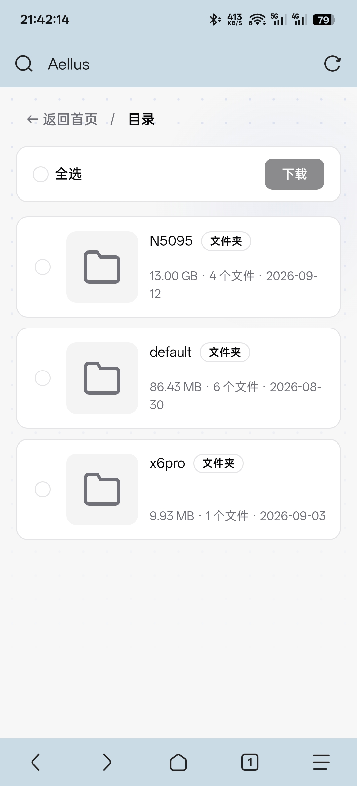
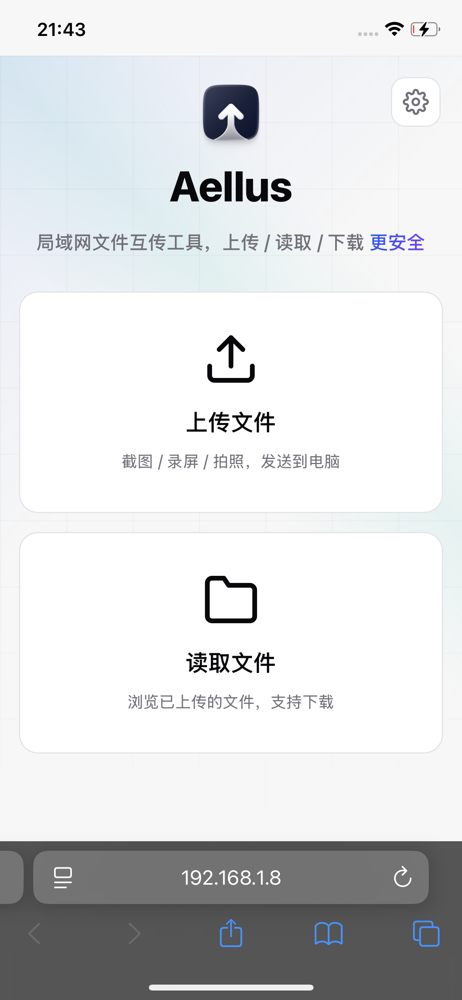
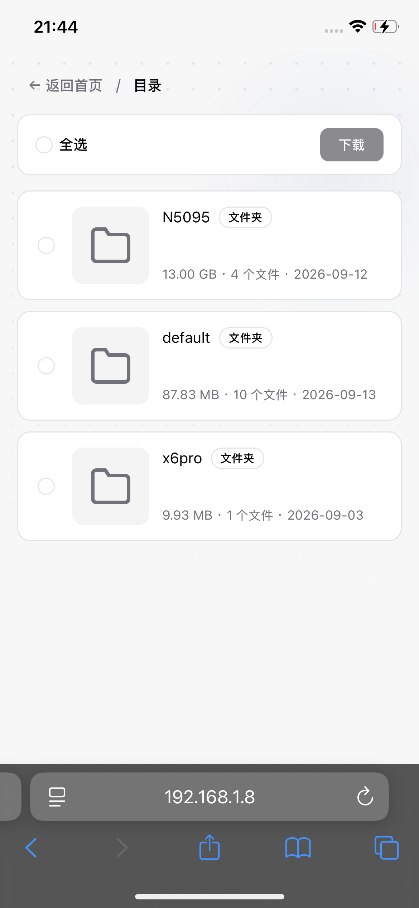

<p align="center">
  
</p>

<h1 align="center">Aellus · 局域网文件互传</h1>

<p align="center">

</p>

> Aellus 之名取自希腊神话中哈耳皮埃（Harpy）三姐妹之长 **Aello**，意为「风暴疾飞」——
> 正如文件在局域网内如风暴般瞬息传递。


Aellus 是一个轻量的局域网文件互传服务。在电脑（macOS / Windows / Linux）或飞牛 NAS 上启动后，同局域网内的手机或 PC 用浏览器访问，即可上传文件、浏览与下载已收到的文件。**零部署、免流量、跨平台、单文件分发**。

---

## ✨ 功能特性

- **上传 / 读取 / 下载**：手机或 PC 浏览器一键发送文件到主机，或浏览已上传文件并下载
- **按设备分目录**：上传时填设备名（自动记忆，下次无需重复输入），文件自动归档到保存目录下的 `<设备名>/` 子目录
- **自动加时间戳**：文件名带精确到毫秒的时间戳，永不覆盖
- **删除保护**：删除文件、修改保存路径只对「管理入口」开放——飞牛端为门户内（经统一网关校验飞牛登录态），桌面端为运行应用的本机（容器 / 网桥 / VPN 地址不算本机）；局域网其它设备只能浏览、上传与下载
- **图片 / 视频预览**：上传后即时预览，读取页缩略图可在线播放，全屏灯箱浏览
- **批量打包下载**：勾选多个文件或整目录一键打包 zip
- **响应式布局**：同时适配 PC 与手机浏览器
- **保存目录可配置**：在首页设置里修改文件保存路径，配置持久化到本地配置文件，重启自动生效
- **桌面端常驻**：macOS 菜单栏 / Windows 系统托盘常驻图标，后台运行不抢焦点
- **飞牛 NAS 支持**：可作为飞牛 fnOS 后台服务运行（`.fpk` 包），复用飞牛授权目录机制
- **路径穿越防护**：严格校验目录名 / 文件名，禁止 `..` 越界与隐藏文件访问，并对软链做真实路径二次校验（浏览 / 下载 / 删除 / 上传全链路）
- **安全防护**：写操作需客户端标识头（防 CSRF）、上传的文件不会被当页面执行、缩略图与请求体有内存上限
- **单文件分发**：前端资源经 `//go:embed` 编译进二进制，运行时无需任何外部文件

---

## 🛒 FnDepot 商店源

本项目已提供 [FnDepot](https://github.com/EWEDLCM/FnDepot) 第三方应用源的 `fnpack.json`，可在飞牛上通过 FnDepot 客户端一键安装 Aellus。

在 FnDepot 客户端「外部源管理」「添加源」中填入本仓库地址：

```text
https://github.com/YGQ8988/Aellus
```

客户端会读取仓库根目录的 `fnpack.json`，按设备架构（x86 / arm）自动选择对应的安装包。

---

## 🚀 快速使用

### 1. 运行

**Windows：** 解压 `dist/Aellus-<version>-windows-x64.zip`（版本号以实际为准），双击里面的 `Aellus.exe`。程序会自动打开默认浏览器并跳转到访问地址，同时在**系统托盘**显示图标——右键菜单可「打开浏览器」或「退出」。

**macOS：**
```bash
chmod +x Aellus-1.0.1-darwin-arm64    # Apple Silicon（M1/M2/M3），版本号以实际为准
# 或 chmod +x Aellus-1.0.1-darwin-x64  # Intel
./Aellus-1.0.1-darwin-arm64
```
或双击 `Aellus.app`，顶部菜单栏出现 Aellus 图标。

**Linux：**
```bash
chmod +x Aellus-1.0.1-linux-x64
./Aellus-1.0.1-linux-x64
```

启动成功会输出访问地址，例如（macOS / Windows 中文，Linux 默认英文）：
```
Aellus 已启动 (Go 单文件版)
保存目录：.../Desktop/file-drops
本机局域网 IP：192.168.1.111
访问地址：http://localhost:5115
手机访问：http://192.168.1.111:5115
按 Ctrl+C 停止
```

### 2. 访问使用

- **本机**：浏览器打开 `http://localhost:5115`（Windows 双击后会自动打开）
- **手机 / 其他设备**：浏览器打开启动时显示的 `http://<主机局域网IP>:5115`

首页提供两个入口：
- 📤 **上传文件** → 填设备名 → 选文件 / 拍照 / 录像 → 上传
- 📂 **读取文件** → 选择目录 → 浏览文件 → 下载或预览

### 3. 自行构建

三个构建脚本各自独立，在对应环境运行：

| 产物 | 脚本 | 运行环境 | 说明 |
|------|------|---------|------|
| macOS `.app` | `build-mac.sh` | Mac 本机（需 Xcode CLT） | arm64 / x64 独立打成 zip，已签名 |
| 全平台 | `build-all.sh` | 任意平台 | macOS / Linux 裸二进制 + Windows `Aellus.exe`（打成 zip） |
| 飞牛 fnOS `.fpk` | `build-fnos.sh` | 需 `fnpack` 工具 | 分架构直接产出 `.fpk`（不套 zip），纯后台服务、无托盘 |

```bash
bash build-mac.sh     # dist/Aellus-<version>-mac-{arm64,x64}.zip      （内含 Aellus.app）
bash build-all.sh     # dist/Aellus-<version>-darwin-{arm64,x64}、-linux-{x64,arm64,x86}（裸二进制）
                      # dist/Aellus-<version>-windows-{x64,arm64,x86}.zip（内含 Aellus.exe）
bash build-fnos.sh    # dist/Aellus-<version>-fnos-{x64,arm64}.fpk    （直接可安装）
```

> 命名风格统一：**文件名带版本与架构**；macOS `.app` 与 Windows `Aellus.exe` 打成 zip（解压即用），飞牛 `.fpk` 与 macOS / Linux 裸二进制不套压缩包（直接使用）。
> 架构标识统一为 `x64`（64 位 x86）/ `x86`（32 位 x86）/ `arm64`。
> 飞牛 `.fpk` **特意不套 zip**：fpk 内部是 gzip 流，macOS 自带归档工具的「必要时继续展开」会把它连同 zip 一起解开，用户解压后拿不到 fpk 文件（只得到解开的文件夹）。
>
> 三个脚本的产物都输出到 `dist/`，并共用 `.build/` 中间目录，**不能并行执行**（结束时会各自清理），需串行运行。
>
> `build-all.sh` 打包 Windows 时会用 `go-winres` 从 `winres/aellus.ico` 生成图标/清单/版本资源（`.syso`），并自动链接进 exe——资源管理器里能看到软件图标，右键“属性→详细信息”有产品名/版本/描述。首次构建前需安装：`go install github.com/tc-hib/go-winres@latest`；未安装时回退使用仓库内已提交的 `.syso`。`.syso` 必须保留在项目根目录（go build 按 `rsrc_windows_<arch>.syso` 命名约定只在包目录自动链接，挪进子目录会导致 exe 图标丢失）。
>
> fpk 构建通过 `-tags fpk` 选择 `internal/platform/platform_fpks.go`（headless 实现），显式排除所有桌面代码（系统托盘 / 原生通知 / 原生文件夹选择 / systray 依赖）；桌面端构建不加该标签，使用 `platform_impl.go`，保持托盘与通知体验。

---

## 📸 界面预览

### 飞牛（fnOS）

| 首页 | 访问二维码 | 上传 | 浏览 | 设置 |
|------|-----------|------|------|------|
|  |  |  |  |  |

### Android

| 首页 | 上传 | 浏览 | 关于 |
|------|------|------|------|
|  |  |  |  |

### iOS

| 首页 | 上传 | 浏览 | 关于 |
|------|------|------|------|
|  |  |  |  |

---

## 🖥 环境依赖

| 项 | 要求 |
|----|------|
| 操作系统 | macOS / Windows / Linux（同一份 Go 代码交叉编译） |
| 运行时 | **无需安装任何运行时**（不依赖 Python / Node / 浏览器内核），双击即用 |
| 网络 | 主机与手机 / 其他设备在**同一局域网**内 |
| 自行编译（可选） | Go 1.21+ |

> 已发布的版本是**单文件可执行程序**：前端 `static/`、`templates/` 在编译期通过 `//go:embed` 打进二进制，运行时目录里不需要这些文件。

---

## 📂 目录结构

```
aellus/
├── main.go                       # 启动入口：embed 资源 + 平台选择 + App 构造 + Serve + 托盘
├── go.mod / go.sum               # Go module（唯一外部依赖 systray；fpk 构建自动剥离）
├── LICENSE                       # MIT 许可证
├── internal/app/                 # 业务逻辑（零 build-tag，纯 Go；平台差异通过 Platform 接口注入）
│   ├── app.go                    # App struct + New/Serve + 常量定义
│   ├── platform.go               # Platform 接口定义（隔离 build-tag 差异）
│   ├── routes.go                 # 路由注册
│   ├── handlers.go               # HTTP handler（上传/下载/浏览/删除/批量下载）
│   ├── settings.go               # 设置 handler（保存目录/授权目录/文件夹选择）
│   ├── config.go                 # 配置解析（保存目录/配置文件读写/旧配置迁移）
│   ├── netx.go                   # 网络工具（局域网 IP / 端口监听 / 本机与权限判定）
│   ├── pathx.go                  # 路径安全（设备名/文件名/穿越防护）
│   ├── resolve.go                # 目录/文件路径解析
│   ├── devnames.go               # 设备名映射（devices.json 读写）
│   ├── thumb.go                  # 缩略图生成
│   ├── trim.go                   # 飞牛授权目录 API
│   ├── middleware.go             # 中间件（日志/安全响应头/no-cache）
│   ├── logx.go                   # 日志写入（含轮转与注入清洗）
│   ├── fileout.go                # 文件输出统一出口（下载 / 缩略图的类型白名单与附件判定）
│   ├── types.go                  # 数据结构定义
│   ├── paging.go                 # 分页计算（总页数/偏移/页码纠正）
│   ├── paging_test.go            # 分页单元测试
│   └── security_test.go          # 安全回归测试（`go test ./...` 即可运行）
├── internal/platform/            # 平台层（build-tag 选择编译；实现 Platform 接口）
│   ├── platform_impl.go          # 桌面端实现（!fpk；托盘/通知/单实例/文件夹选择）
│   ├── platform_fpks.go          # fpk 端实现（//go:build fpk；headless 桩）
│   ├── tray_darwin.go            # macOS 菜单栏（systray + cgo）
│   ├── tray_windows.go           # Windows 托盘（纯 syscall，零依赖）
│   ├── tray_other.go             # Linux 信号阻塞（无托盘）
│   ├── notify_darwin.{go,m}      # macOS 系统通知（Cocoa）
│   ├── notify_windows.go         # Windows 气球通知
│   ├── notify_other.go           # 通知空实现
│   ├── pickdir_windows.go        # Windows 原生目录对话框
│   ├── pickdir_other.go          # 目录选择占位
│   ├── single_windows.go         # Windows 单实例（Mutex）
│   ├── single_other.go           # Unix 单实例（flock）
│   ├── app_agent_darwin.go       # macOS AppKit 激活策略（后台运行，Dock 不弹跳）
│   ├── forceSetTemplateIcon.m    # macOS 菜单栏图标 cgo ObjC
│   ├── menuicon.png              # macOS 菜单栏图标（embed）
│   └── favicon.ico               # Windows 托盘图标（embed）
├── templates/                    # HTML 页面（已编译进二进制）
│   ├── home.html                 # 首页
│   ├── upload.html               # 上传页
│   └── browse.html               # 读取页
├── static/                       # 前端静态资源（已编译进二进制）
│   ├── css/                      # 样式：common / components / home / upload / browse
│   ├── js/                       # 脚本：ui.js（通用 UI + 设备 ID + 客户端标识头）/ upload.js / browse.js / qrcode.js
│   └── img/                      # 图标与图片：logo-icon.png / icon.png / favicon.svg / 打赏二维码
├── build-mac.sh                  # macOS .app 构建脚本
├── build-all.sh                  # 全平台构建脚本（macOS/Linux 裸二进制 + Windows exe 打成 zip）
├── build-fnos.sh                 # 飞牛 fnOS .fpk 构建脚本（分架构，直接产出 .fpk）
├── aellus.icns                   # macOS 应用图标
├── winres/                       # Windows 图标相关（源图标 + 工具脚本）
│   ├── aellus.ico                # Windows 应用图标（多尺寸，go-winres 打包进 exe）
│   ├── make_ico.py               # 图标生成工具：PNG → 多尺寸 ICO（改图标时用）
│   └── check_pe_icon.py          # 校验脚本：检查 exe 是否含图标/版本资源
├── rsrc_windows_{amd64,arm64,386}.syso  # Windows 图标/清单/版本资源（go build 在根目录自动链接）
├── screenshots/                  # 界面预览截图（README「界面预览」章节引用：飞牛 / Android / iOS）
├── fnos/                         # 飞牛 fnOS 打包资源（manifest / config / cmd）
└── README.md
```

### 上传文件落盘位置

桌面端默认保存在**用户桌面**下的 `file-drops/`（可在首页设置里改）：

```
~/Desktop/file-drops/
└── <设备名>/
    └── 20260914_143022.123456_截图.png   # 时间戳_原文件名
```

> 目录内还有一个隐藏的中转目录 `.aellus-tmp`（上传与打包的临时文件；正常使用可忽略，也可整目录删除）。

飞牛 NAS 端保存目录由飞牛「应用设置 → 授权目录」注入，落在授权目录树内。

---

## ⚙️ 配置说明

### 文件保存目录（设置与限制）

保存目录在**飞牛**与**非飞牛（桌面端）**设备上的设置方式与限制不同：

| 维度 | 非飞牛（桌面端） | 飞牛（fnOS） |
|------|----------------|-------------|
| 默认目录 | 桌面 `~/Desktop/file-drops` | 飞牛「应用设置 → 授权目录」注入 |
| 修改方式 | 首页设置：输入绝对路径 / 系统目录选择器 | 首页设置：从已授权目录下拉选择 |
| 可修改来源 | 仅本机（`127.0.0.1` 或本机物理网卡地址；容器 / 网桥 / VPN 地址不算本机） | 飞牛门户内（经统一网关，先校验飞牛登录态） |
| 边界限制 | 无（用户自主决定落盘位置） | 强制落在授权目录树内，越界返回 403 |
| 持久化 | 写入 `aellus-settings.json`，重启生效 | 写入 `TRIM_PKGVAR/aellus-settings.json`，重启生效 |

- **非飞牛（桌面端）**：默认保存在桌面 `file-drops/`，可在首页「设置 → 文件保存路径」改成任意绝对路径或用系统目录选择器选取；修改仅本机可操作，持久化到系统配置目录的 `aellus-settings.json`，重启后仍生效。
- **飞牛（fnOS）**：保存目录完全由飞牛授权接管——管理员在飞牛「应用设置 → 授权目录」中授权目录，应用通过官方 `trim.file.getSharedAccessibleFolders` 接口（环境变量兜底合并）读取授权列表，前端以下拉方式选择并展示语义化路径（`/vol1/...` 自动转为「存储空间…」），且强制落盘目录位于授权目录树内（越界拒绝）。修改同样只能在飞牛门户内操作，持久化到 `TRIM_PKGVAR` 持久卷、重启后仍生效；若授权被移除，重启时回退到飞牛注入的默认目录。

### 数据持久化

桌面端用户数据统一存放在**系统配置目录**下，飞牛端存放在飞牛私有运行时数据目录（`TRIM_PKGVAR`，位于 `/vol` 持久卷），删除 / 重装程序不丢失：

| 平台 | 配置目录 |
|------|---------|
| macOS | `~/Library/Application Support/Aellus/` |
| Windows | `%APPDATA%\Aellus\` |
| Linux | `~/.config/Aellus/` |
| 飞牛 fnOS | `TRIM_PKGVAR/`（如 `/vol1/@appdata/Aellus/`） |

| 文件 / 目录 | 作用 |
|------------|------|
| `aellus-settings.json` | 保存目录配置，重启自动生效 |
| `devices.json` | 设备名映射（记住每个设备填过的名字） |
| `logs/` | 访问日志 `access.log` + 操作日志 `operation.log` |

### 环境变量

| 变量 | 作用 | 默认 |
|------|------|------|
| `AELLUS_PORT` | 监听端口（被占用自动 +1） | `5115` |
| `AELLUS_SAVE_DIR` | 保存目录（飞牛 cmd/main 注入） | 桌面 `~/Desktop/file-drops` |
| `AELLUS_LANG` | 控制台输出语言：`en` / `zh` | Linux=`en`，其余=`zh` |
| `AELLUS_HEADLESS` | `1` 时跳过托盘 GUI，仅常驻 HTTP（CI / 调试） | 未设置 |
| `AELLUS_STRICT_PORT` | `1` 时端口被占用直接退出（不自动 +1），飞牛端由启动脚本注入 | 未设置 |
| `AELLUS_LOGS_DIR` | 日志目录（飞牛启动脚本注入，默认 `TRIM_PKGVAR/logs`） | 平台默认 |

> 另有一组由飞牛启动脚本注入、无需手工设置的变量：`TRIM_*`（打包 / 数据 / 共享目录）、`FNNAS_GATEWAY_SOCKET` 与 `FNNAS_GATEWAY_PREFIX`（统一网关 Socket 与门户路径前缀）。

### 源码常量

核心默认值集中在 `internal/app/app.go` 的常量区，按需修改后重新编译。其余与安全 / 资源相关的上限（缩略图尺寸、上传表单字段长度、日志轮转大小与长度、设备名映射容量）分散在各业务文件顶部的常量区，注释里写明了取值原因：

```go
const (
    saveDirName = "file-drops"  // 文件保存目录名（桌面端路径：~/Desktop/file-drops）
    DefaultPort = 5115          // 默认端口；被占用自动尝试 5116、5117……
)
```

---

## 🛠 服务管理

- **macOS**：双击 `Aellus.app` 启动，顶部菜单栏出现 Aellus 图标，后台运行（不在 Dock 弹跳）；点菜单「退出」停止
- **Windows**：双击 `Aellus.exe` 启动；右键系统托盘图标 →「退出」停止（也可任务管理器结束进程）
- **Linux**：终端运行二进制；`Ctrl+C` 停止
- **飞牛 NAS**：作为 fnOS 后台服务运行，由 fnOS / systemd 管理生命周期

> 未配置开机自启。如需自启：macOS 可配置 launchd，Windows 可配置任务计划程序，Linux 可配置 systemd。

---

## 📜 免责声明

本工具为局域网环境下的文件传输而开发。

关于第三方部署：任何人将本软件部署至公网服务器、或修改后用于面向不特定公众的服务，由此产生的全部法律责任（包括但不限于内容审核、数据合规、网络安全、版权纠纷等）由部署方自行承担。开发者仅提供开源代码，不参与任何第三方部署实例的运营与管理，亦非《网络安全法》第七十六条所称之"网络运营者"。

开源许可：本项目代码按 [MIT License](./LICENSE) 发布。

关于捐赠：项目主页的打赏入口是对开发者个人的自愿赠与，不构成软件购买、服务合同或技术支持承诺。打赏与否工具的功能和使用权限都不会有任何变化。

---

## ❓ 常见问题

**Q：手机 / 其他设备打不开页面？**
- 确认主机和设备在同一个局域网内
- 公司网络可能开启了「客户端隔离」，用手机开热点测试验证
- 首次启动若系统弹窗「是否允许程序接受入站连接」（macOS 防火墙 / Windows Defender 防火墙），点**允许**

**Q：换网络后访问地址变了？**
- 局域网 IP 会随网络变化，看启动时打印的 `访问地址：` / `Mobile:` 一行即可

**Q：Windows 双击没反应？**
- 本程序是「无控制台窗口」的 GUI 程序，正常运行时本就不会弹出黑窗口；双击后请查看**系统托盘**是否有图标，并确认默认浏览器是否已打开
- 若完全无反应，可能是端口被占用或杀毒软件拦截，建议在终端手动 `.\Aellus.exe` 看报错

**Q：Linux 终端中文显示成黑方块？**
- 部分终端字体缺中文字形导致；Linux 版默认已输出英文规避。如需中文，设 `AELLUS_LANG=zh` 并确保终端字体含中文字形

**Q：上传大文件（录屏几百 MB）失败？**
- 采用流式读写，不会一次性占满内存；上传期间临时文件写在保存目录内的隐藏子目录 `.aellus-tmp/`（与保存目录同一块盘），落盘时改名完成、随即释放
- 单个文件没有大小限制（设计如此），但请留意**保存目录所在卷**的空间；若超时请检查网络稳定性

**Q：想用脚本 / 命令行调接口（上传、删除、改保存目录）？**
- 所有**写操作**都必须带客户端标识头 `X-Aellus-Client: 1`（服务端据此拒绝跨站请求；不带会返回 `403 缺少客户端标识头`）：

  ```bash
  NAS=http://192.168.1.111:5115; H='X-Aellus-Client: 1'
  curl -s -X POST "$NAS/upload" -H "$H" -F "device=MAC" -F "files=@$HOME/a.zip" -F "rels=a.zip"
  curl -s -X POST "$NAS/api/delete" -H "$H" -H "Content-Type: application/json" -d '{"dir":"MAC","file":"20260804_112601079_a.zip"}'
  curl -s -X POST "$NAS/api/set-savedir" -H "$H" -H "Content-Type: application/json" -d '{"dir":"/vol1/1000/photo"}'
  ```

- 只读接口（`/api/dirs`、`/api/files`、`/api/thumb`、`/api/download`）不需要该头
- **上传**：局域网内任何设备都能调；**删除 / 改保存目录**还需要「管理入口」——桌面端在本机执行，飞牛端只能在门户内（脚本直连 `IP:5115` 会返回 `403 无删除权限`，可直接在 NAS 上操作文件系统）

---

## 🧰 技术栈

| 层 | 技术 |
|----|------|
| 运行平台 | macOS / Windows / Linux + 飞牛 fnOS（单文件，零运行时依赖） |
| 后端 | Go 1.21+（标准库为主：`net/http` / `embed` / Windows 托盘用 `syscall`；macOS 菜单栏用 getlantern/systray） |
| 前端 | 原生 HTML5 / CSS3 / JavaScript（无框架） |
| 打包 | 静态资源 `//go:embed` 编译进二进制；macOS 打 `.app`、Windows 打 `Aellus.exe`（两者封成 zip），飞牛用 `fnpack` 直接打 `Aellus.fpk` |
| 传输 | HTTP（局域网点对点，不走云端） |

---

## 💬 反馈与建议

如果有更好的功能想法或改进建议，欢迎提 [Issues](https://github.com/YGQ8988/Aellus/issues)。

---

## ☕ 赞赏

如果 Aellus 对您有所帮助，可以请我们喝一杯咖啡吗？

<table>
  <tr>
    <td align="center">
      <br>
      <sub>开发者 染洛凉</sub>
    </td>
    <td align="center">
      <br>
      <sub>设计师 一西啊</sub>
    </td>
  </tr>
</table>
